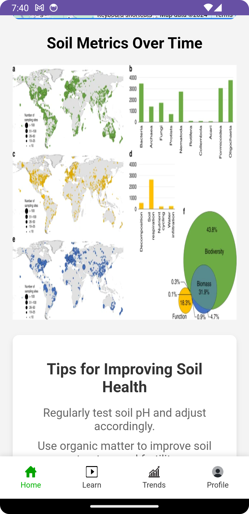

## 🌿 PlantMed: AI-Powered Crop Disease Detection  

**PlantMed** is a mobile application that leverages artificial intelligence to diagnose crop diseases by analyzing images of plant leaves. Designed with farmers and gardeners in mind, the app offers a user-friendly experience to ensure plant health and promote sustainable agriculture.  

### 🚀 Key Features  
- **Disease Detection:** Upload or capture leaf images to identify diseases.  
- **Actionable Insights:** Get tailored treatment suggestions for healthier crops.  
- **Chatbot Assistance:** Interactive chatbot for plant care tips and answers to FAQs.  
- **Intuitive UI:** A sleek blackish-grey and green-themed interface for seamless navigation.  

### 🛠️ Technologies Used  
- **Android Studio (Java):** For app development.  
- **Jupyter Notebook** For training and evaluating the performance of the trained model and prediction 
- **ChatLing.ai:** For chatbot integration.  

### 🌱 How It Works  
1. Upload or capture an image of a plant leaf.  
2. The AI model analyzes the image and identifies the disease.  
3. View results with disease details and recommended treatments.  
4. Access additional tips through the chatbot feature.  
  

# Plantmed Project

This repository contains the source code for the **Plantmed** app, an innovative plant disease detection and management application. Below is a showcase of various pages and features of the app.

## Table of Contents
1. [Home Page](#home-page)
2. [Sign In/Sign Up](#sign-insign-up)
3. [Plant Detection](#plant-detection)
4. [Soil Status](#soil-status)
5. [Government Schemes](#government-schemes)
6. [Chatbot Integration](#chatbot-integration)
7. [Diagnostic Page](#diagnostic-page)
8. [Learn More](#learn-more)
9. [Profile Page](#profile-page)
10. [Trends](#trends)

---

## Home Page

The home page is the main landing page of the app, giving the user an overview and access to core features.

---

## Sign In/Sign Up

This section showcases the login and sign-up pages, allowing users to authenticate and access the app.

- **Sign In Page**: 
- **Sign In Failure**: 
- **Sign Up Page**: 
- **Sign Up Success**: 
- **Login Success**: 

---

## Plant Detection

This feature allows users to upload images of leaves for disease detection. The app analyzes the images and provides feedback on plant health.

---

## Soil Status

The soil status page provides important information related to soil health, including data on moisture, pH, and other soil metrics.

- **Soil Status 1**: 
- **Soil Status 2**: 
- **Soil Status 3**: 
- **Soil Status 4**: 

---

## Government Schemes

This page highlights government schemes available for farmers, offering insights into available subsidies, grants, and support.

- **Scheme 1**: 
- **Scheme 2**: 
- **Scheme 3**: 

---

## Chatbot Integration

The app includes a chatbot that helps users with queries, guides them through plant care, and provides additional support.

- **Chatbot Page 1**: 
- **Chatbot Page 2**: 
- **Chatbot Page 3**: 
- **Chatbot Page 4**: 
- **Chatbot Page 5**: 
- **Chatbot Page 6**: 

---

## Diagnostic Page

The diagnostic page helps users analyze their plant’s health status through visual recognition of symptoms.

- **Diagnose Page 1**: 
- **Diagnose Page 2**: 

---

## Learn More

This section provides educational resources to users on plant care and disease management.

- **Learn Page 1**: 
- **Learn Page 2**: 
- **Learn Page 3**: 

---

## Profile Page

The profile page allows users to view and edit their account details, including personal information and preferences.

- **Profile Page 1**: 
- **Profile Page 2**: 
- **Profile Page 3**: 

---

## Trends

This feature presents trends related to soil health, plant disease outbreaks, and weather patterns.

- **Trends Page 1**: 
- **Trends Page 2**: 
- **Trends Page 3**: 

---

## Additional Screenshots

- **Scan Crop Image**: 
- **Upload Image Page**: 
- **Weather Information**: 
- **About Page 1**: 
- **About Page 2**: 
- **About Page 3**: 

---

## Conclusion

This app aims to simplify plant health management by providing features like disease detection, soil status monitoring, and educational resources. The integration of a chatbot and diagnostic tools makes it a useful tool for both amateur and professional gardeners alike.

---

## License

This project is licensed under the MIT License - see the [LICENSE](LICENSE) file for details.

---  
> **Note:** This project is a work in progress. Stay tuned for updates!  

